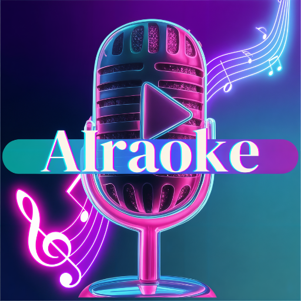

# 🎤 AIraoke

<p align="center">
  
</p>

<a href="https://buymeacoffee.com/cmpcreativn" target="_blank">
  
</a>

**AIraoke** is a fun, experimental app that brings lyric transcriptions to life as karaoke-style MP4 videos. Built on Python-Lyric-Transcriber’s transcription logic, it adds a custom Gradio UI to visualize lyrics with beat-synced effects. Running locally on PC, Linux, or Mac without APIs, it uses Whisper for transcription, an LLM for optional lyric tweaks, and Demucs for vocal separation. Outputs may not be perfect, but it’s a creative playground for karaoke lovers, creators, and audio enthusiasts!

---

## 🚀 Features

- 🎧 **Audio Transcription** using OpenAI Whisper (Turbo / Large-v3)
- 🧠 **LLM Correction** for enhanced lyric accuracy (auto-downloaded)
- 🔊 **Demucs Integration** to separate vocals and generate instrumentals
- 🕺 **Beat Detection** for video background "Audio Particles" this is enabled by default does not affect all other video options
- 🎥 **Karaoke Video Output** see your generated video under the Video Playback in the Gradio interface
- 🖥️ **Gradio UI** – Easy-to-use web interface
- 📂 Outputs: `.txt`, `.lrc`, `.ass`, and `.mp4` video

---

## 🛠️ Installation (Cross-Platform)

---

### ⚠️ FFmpeg Setup (if errors occur)

If you encounter errors related to **ffmpeg**, download it manually:

1. Go to: [https://www.gyan.dev/ffmpeg/builds/](https://www.gyan.dev/ffmpeg/builds/)
2. Download the file: `ffmpeg-release-full.7z`
3. Extract it to a folder (e.g., `C:\ffmpeg7.1.1`)
4. Add bin folder path (e.g., `C:\ffmpeg7.1.1\ffmpeg-7.1.1-full_build\bin`) to your system's environment PATH.
5. Optional: Inside the extracted folder, find and copy:
   - `ffmpeg.exe`
   - `ffplay.exe`
   - `ffprobe.exe`
6. Create a `bin` folder (e.g., `AIraoke\bin`) and paste the above files into it

On Linux/macOS: use your package manager (e.g., `sudo apt install ffmpeg` or `brew install ffmpeg`)


AIraoke works on **Linux**, **Windows**, and **macOS**. Follow the steps below:

---

### ✅ Step 1: Upgrade pip

```bash
pip install --upgrade pip
# or
python.exe -m pip install --upgrade pip
```

---

### ✅ Step 2: Install PyTorch

Choose the appropriate command for your system. For full compatibility, refer to: [https://pytorch.org/get-started/locally](https://pytorch.org/get-started/locally)

#### 🖥️ For GPU (NVIDIA CUDA):

**Example for CUDA 11.8:**
```bash
pip install torch torchvision torchaudio --index-url https://download.pytorch.org/whl/cu118
```

**Example for CUDA 12.1 or later:**
```bash
pip install torch torchvision torchaudio --index-url https://download.pytorch.org/whl/cu121
```

**Also tested and working:**
```bash
pip install torch==2.4.1 torchvision==0.19.1 torchaudio==2.4.1 --index-url https://download.pytorch.org/whl/cu118
```

#### 🧠 For CPU-only (Linux, Windows, macOS):

```bash
pip install torch torchvision torchaudio
```

---

### ✅ Step 3: Install AIraoke in editable mode

```bash
pip install -e .
```

---

### ✅ Step 4: Install dependencies

```bash
pip install -r requirements.txt
```

Dependencies include:

```
demucs
opencv-python
scipy
diffq
pydub
librosa
StrEnum
cattrs
toml
tomli
ffmpeg
ffprobe
bitsandbytes>=0.43.1
transformers>=4.47.0
spacy
```

---

### ✅ Step 5: Additional packages

```bash
pip install gradio==5.29.1 devicetorch
pip install openai-whisper
python -m spacy download en_core_web_sm
```

---

## 🧪 Running the App

```bash
python -m gradio_ui
```

The app will launch at:  
[http://localhost:7860](http://localhost:7860)

---

## 📂 Output Files

Transcriptions and videos will be saved in the `output/` directory:

- `.txt` – Original and corrected lyrics
- `.lrc` – Lyric synchronization
- `.ass` – Styled subtitle format
- `.mp4` – Karaoke video 

---

## 🎨 Customization Options

- 🎬 Add your own videos to: `app/gradio_ui/backgrounds`
- 🎨 Choose your font color, resolution (360p to 4K)
- ⚙️ Enable or disable LLM correction and vocal separation

---

## 🙌 Credits

AIraoke is built on top of the amazing work from the open-source community. Special thanks to the following projects and their creators:

- **[Python-Lyric-Transcriber](https://github.com/nomadkaraoke/python-lyrics-transcriber)** by [nomadkaraoke](https://github.com/nomadkaraoke) — The core logic for lyric transcription in AIraoke. We adapted this project by adding a Gradio-based user interface and MP4 video output for visualizing lyric transcriptions.
- **[Whisper](https://github.com/openai/whisper)** by OpenAI — The transcription engine used for converting audio to text.
- **[Demucs](https://github.com/facebookresearch/demucs)** by Meta AI — The vocal separation model used to isolate vocals from audio tracks.
- Gradio UI and enhancements by **TheAwakenOne**

Please respect the licenses and terms of these projects when using AIraoke. Check their respective repositories for details.

---

## 🧠 Built With Love

AIraoke is an experimental tool crafted for creators, karaoke lovers, and audio experimenters. Designed to run locally on PC, Linux, or Mac, it uses Whisper for transcription and an LLM for lyric processing without relying on external APIs. Please note that the output may not always be perfect, as transcription and lyric alignment can vary. I hope AIraoke sparks joy and creativity in your lyric visualization projects, even if it’s a work in progress!

📎 License

AIraoke is licensed under the MIT License. See the LICENSE file for details. This project incorporates code from Python-Lyric-Transcriber, which is also licensed under the MIT License.
